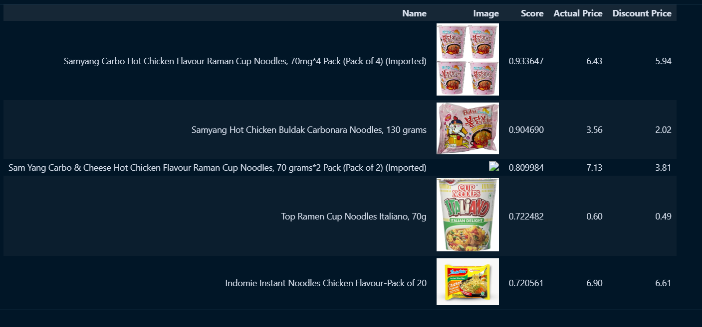

# LLM Hybrid Recommender System

A hybrid product recommendation system that combines **Weaviate vector database** hybrid search with **OpenAI LLM** suggestions to deliver accurate, context-aware product recommendations.

## How It Works

```
User Query ──> OpenAI LLM ──> Product Suggestions ──> Weaviate Hybrid Search ──> Real Catalog Matches
```

1. **User submits a query** (e.g., "chicken noodles")
2. **LLM generates suggestions** — GPT-3.5-turbo produces a list of relevant product names
3. **Hybrid search retrieves results** — Weaviate combines BM25 keyword matching with semantic vector search to find real products from the catalog
4. **Near-object expansion** — Weaviate finds additional similar products using vector proximity

## Architecture

| Component | Role |
|-----------|------|
| **OpenAI GPT-3.5-turbo** | Generates intelligent product recommendations from natural language queries |
| **Weaviate (text2vec-openai)** | Stores product embeddings and performs hybrid search (BM25 + vector) |
| **Pandas** | Data cleaning, transformation, and result display |

## Recommendation Approaches Compared

| Aspect | Traditional | Hybrid | LLM-Enhanced |
|--------|------------|--------|-------------|
| Cold Start Problem | Severe | Mitigated | Minimal |
| Data Requirements | Structured only | Structured | Structured & Unstructured |
| Personalization | Basic | Moderate | High |
| Context Awareness | Low | Medium | High |

### Visual Results

**Hybrid Search Results:**


**LLM-Enhanced Results:**



## Dataset

Uses the [Amazon Product Sales Dataset](https://www.kaggle.com/) with ~550K products across 142 categories. The notebook filters to the *grocery & gourmet foods* category and samples 1,000 products for demonstration.

## Setup

### Prerequisites

- Python 3.10+
- [Weaviate Cloud Services](https://console.weaviate.cloud) account (free sandbox available)
- [OpenAI API key](https://platform.openai.com/api-keys)

### Installation

```bash
git clone https://github.com/YOUR_USERNAME/llm-hybrid-recommender-system.git
cd llm-hybrid-recommender-system
pip install -r requirements.txt
```

### Configuration

Create a `.env` file in the project root:

```env
OPENAI_API_KEY=sk-your-openai-key
WCS_URL=https://your-cluster.weaviate.network
WCS_API_KEY=your-weaviate-api-key
```

### Run

```bash
jupyter notebook recommender-system.ipynb
```

## Project Structure

```
├── recommender-system.ipynb   # Main notebook with full pipeline
├── requirements.txt           # Python dependencies
├── images/                    # Result screenshots for documentation
├── dataset/                   # Amazon Products CSV (not tracked in git)
├── .env                       # API keys (not tracked in git)
└── README.md
```

## Key Features

- **Hybrid search** — Combines keyword (BM25) and semantic (vector) search for better recall and precision
- **LLM-augmented recommendations** — Uses GPT to expand user queries into richer product suggestions
- **Near-object similarity** — Discovers related products through embedding space proximity
- **Clean data pipeline** — Handles missing values, currency conversion (INR → USD), and type casting

## References

- [Recommender System using LLMs and Vector Databases — Medium](https://medium.com/@haziqa5122/recommender-system-using-llms-and-vector-databases-03fa90e850d1)
- [Weaviate Documentation](https://weaviate.io/developers/weaviate)
- [OpenAI API Reference](https://platform.openai.com/docs/api-reference)

## License

This project is licensed under the MIT License — see the [LICENSE](LICENSE) file for details.